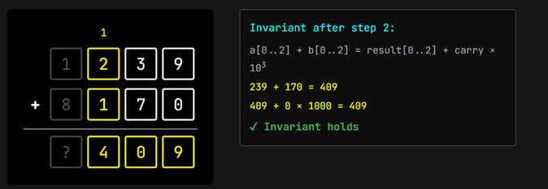
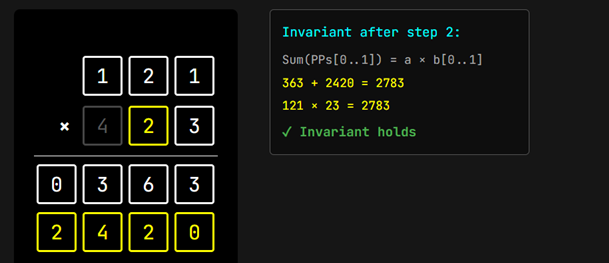
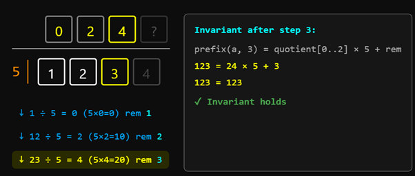
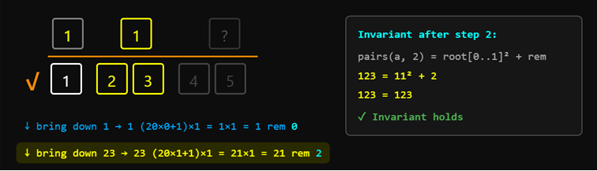

# Learn2Lean — Verified Pen-and-Paper Arithmetic in Lean 4

A summer project at **FP Launchpad, IIT Madras**, under **Prof. KC Sivaramakrishnan**.

Two things live in this repo:

1. **Learn2Lean** — an interactive web book that teaches formal-verification thinking (and a little Lean 4) by taking the arithmetic algorithms everyone learns in school and proving them correct. Nine chapters, from reading Lean code to square roots by hand: each has a worked example, a step-through visualiser, the proof told first as an argument in plain words with the full Lean folded underneath, multiple-choice checks, and worksheets you can run against a live Lean checker.
2. **The formalisation** — the Lean 4 sources the book is built on: every algorithm implemented and proved correct against a `toNat` specification, each with a ProofWidgets visualisation.

## Reading the book

The book is plain HTML/CSS/JS, so no build is needed just to read it.

- **Quickest:** open `web/cover.html` in any browser. Everything works except the worksheet **Run** button — prose, visualisers, quizzes, hover tooltips (with goal states), and every exercise's reference solution.
- **Full experience (with live code-checking):** follow *Running the checker* below, then browse to `http://localhost:5000/cover.html`.

Chapters: 0 · Reading Lean Code — 1 · Vertical Addition — 2 · Vertical Subtraction — 3 · Long Multiplication — 4 · Long Division — 5 · Divisibility Tests — 6 · Euclid's GCD — 7 · The Cube-Root Trick — 8 · Square Roots by Hand — Epilogue.

## Running the checker (optional)

The worksheets can compile your answers with Lean and tell you whether they are right. This needs Lean and Python.

Prerequisites: [Lean 4](https://leanprover.github.io/lean4/doc/quickstart.html) via the `elan` version manager (the toolchain pinned in `lean-toolchain` installs automatically), and Python 3.

```bash
git clone https://github.com/UnOrdinary19/Lean_formalization.git
cd Lean_formalization
lake exe cache get          # download prebuilt Mathlib oleans (skipping this = a 1-2h compile)
lake build                  # build the project the checker verifies against
pip install -r web/checker/requirements.txt
python web/checker/app.py   # serves the book + the checker at http://localhost:5000
```

Then open `http://localhost:5000/cover.html`; the worksheet **Run** buttons now compile your code. Reference fills for every exercise live in `Arithmetic_Formalization/ExerciseScaffolds.lean` (all verified to compile). See `web/checker/README.md` for details and the sandbox note — the checker runs arbitrary Lean, so keep it on `localhost`.

## The formalisation

Every algorithm is written as a Lean program over digit lists (least-significant-first) and proved correct against `toNat`, the function that reads a digit list back to the natural number it stands for.

- **Addition, Subtraction, Multiplication, Division** — the four school operations: carries, borrows, partial products and the trial-digit search, each proved correct (subtraction and division carry their preconditions, `b ≤ a` and `b ≠ 0`).
- **Divisibility** — the tests for 2, 3, 5, 9 and 11 via modular arithmetic, with `myMod` bridged to `Nat.mod` through Chapter 4's long division.
- **Euclid's GCD** — the subtractive algorithm, with a termination proof and equality to `Nat.gcd`.
- **Cube root and square root** — the mental / pen-and-paper methods, proved correct (the square root is shown to return exactly ⌊√n⌋).

### Visualisations
Each algorithm ships a [ProofWidgets](https://github.com/leanprover-community/ProofWidgets4) widget that renders its execution step by step in the Lean infoview, with the loop invariant maintained at each stage. Open any file under `Arithmetic_Formalization/Visualization/` in VS Code (with the Lean 4 extension) and place your cursor on an `#html` command.

**Vertical addition** — column carries, invariant `a[0..k] + b[0..k] = result[0..k] + carry·10ᵏ`:



**Long multiplication** — partial products summed, invariant `Sum(partial products) = a × b[0..k]`:



**Long division** — bring-down steps, invariant `prefix = quotient × divisor + remainder`:



**Integer square root** — the digit-pair radical method, invariant `pairs = root² + remainder`:



## Project layout

```text
Arithmetic_Formalization/
├── Foundations.lean        -- digit / number representation (LSB-first) + toNat
├── Addition.lean           -- vertical addition + correctness
├── Subtraction.lean        -- vertical subtraction (precondition b ≤ a) + correctness
├── Multiplication.lean     -- long multiplication (partial products) + correctness
├── Division.lean           -- long division (trial-digit search) + correctness
├── Divisibility.lean       -- digit tests for 2/3/5/9/11 via modular arithmetic
├── EuclidGCDAlgo.lean      -- subtractive gcd + termination + equality to Nat.gcd
├── CuberootTrick.lean      -- the two-glance cube-root trick, proved two ways
├── Squareroot.lean         -- integer square root (returns ⌊√n⌋) + correctness
├── ExerciseScaffolds.lean  -- reference fills for the web worksheets (all compile)
└── Visualization/          -- ProofWidgets visualisations, one per algorithm
web/
├── cover.html … epilogue.html   -- the Learn2Lean book (open cover.html to start)
├── book.css, book.js            -- shared design + behaviour
└── checker/                     -- optional Flask server that compiles worksheet answers
```

Each core file imports only the specific Mathlib tactics it uses, keeping the build's dependency closure small. `lake-manifest.json` is committed so `lake exe cache get` resolves the exact Mathlib revision.

## Acknowledgements

Developed as a summer project at **FP Launchpad, IIT Madras**, under the guidance of **Prof. KC Sivaramakrishnan**.
</content>
